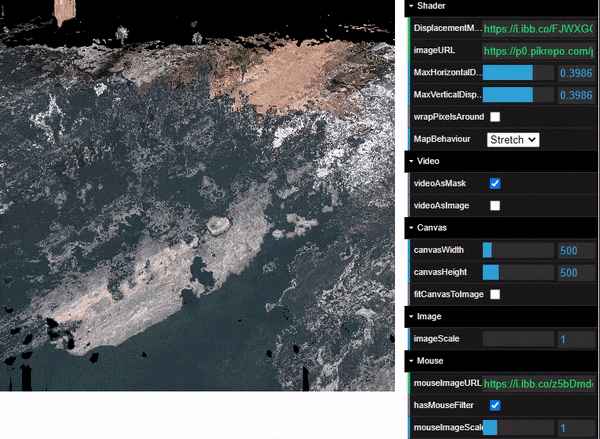

# Displacement map implementation

Displacement map filter implementation using WebGL/GLSL. 
Playground available, just start the app by running on the project root the cmd
`npm run server` 

On the playground, the dat-gui interface is divided by filter category options such as,

- `Shader`:
  - `imageURL`: change background image;
  - `DisplacementMapURL`: change filter mask image;
  - `MaxHorizontalDisplacement`: amount of displacement on X;
  - `MaxVerticalDisplacement`: amount of displacement on Y;
  - `MapBehaviour`: how would you like your default map, options:
    -`Stretch`: adjust filter size to image size;
    -`Tile`: repeat filter on X/Y;
    -`Center`: keep original filter size and center it;
    -`None`: ignore filter image.

- `Video`:
  - `videoAsMask`: video to use as filter mask;
  - `videoAsImage`: use a vídeo as background image instead (overrides `imageRL`);
 
- `Canvas`: adjust canvas size;
- `Image`: set image scale

- `Mouse`:
  - `MouseImageUrl`: image to use as mouse filter
  -`hasMouseFilter`: enable/disable mouse filter
  - `mouseImageScale`: change mouse filter size

Have fun! :art: :mag_right:

## Examples

#### Mouse attached mask

#### Video as mask

#### Image as mask

